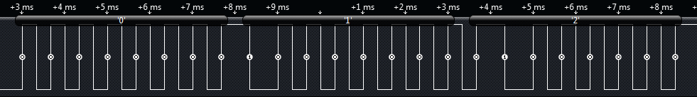

# Manchester

## Manchester

Manchester is a line encoding—it simply describes a method to convert binary ones and zeros into a signal to be transmitted electrically. It's not a protocol. That means that if you want to include information like address, source, or packet structure, you need to apply a protocol layer on top. Manchester is a single wire self-clocking signal. It's used in Ethernet & many wireless applications. It's characterized by having a transition in the center of the bit frame, and the direction of the transition determines if the bit is a one or a zero. (Extra transitions are inserted between bits to accommodate this.)

The Saleae Manchester analyzer also includes differential Manchester bi-phase space code and bi-phase mark code support.

**Resources**

* [Wikipedia](http://en.wikipedia.org/wiki/Manchester_code)

**What Logic Decodes**

<figure><figcaption></figcaption></figure>
