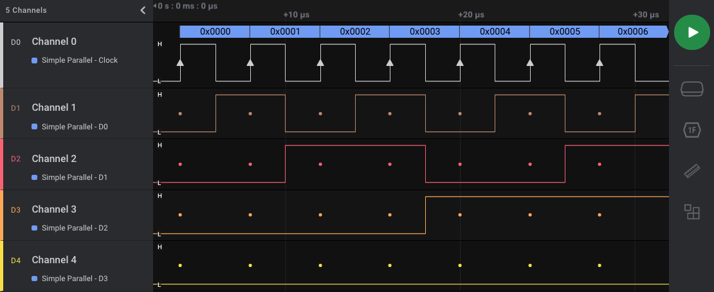

# Simple Parallel

Generally speaking, a parallel bus has multiple data lines and a single clock line. Data is valid—and sampled—on a specified edge (typically rising or falling) of the clock line.

**Top Resources**

* [Wikipedia](http://en.wikipedia.org/wiki/Parallel_communication)

**Example Simple Parallel Parts**

* [Serial/Parallel Port Adapter](http://www.monoprice.com/Product?seq=1\&format=2\&p_id=6195\&CAWELAID=1329452254\&catargetid=320013720000011157\&cadevice=c\&cagpspn=pla\&gclid=CK-xhfPL-boCFQpBQgodj0IAng)

**What Logic Decodes**

<figure><figcaption></figcaption></figure>

* Rising edge or falling edge of clock
* One to eight data lines
