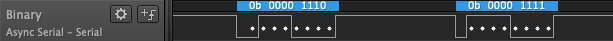
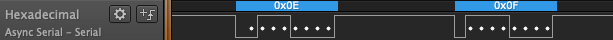
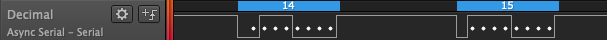
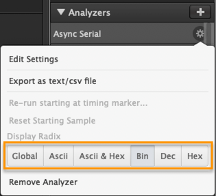
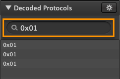

# What is a Display Radix?

## What is a Display Radix?

A radix is simply a way a number can be represented. The most commonly known radix is _decimal_, which utilizes ten digits from 0-9 to represent numbers. Surprisingly, there are many more ways numbers can be represented besides the decimal format! Using the decimal format when decoding digital data can be a bit messy. Therefore, other numeric radices, such as _hexadecimal_ and _binary_, are typically used in these cases.

### Common Radices Used to Represent Digital Data

Below is an example of the same data represented in different radices in Logic software.

#### Binary \(bin, base 2\)

Binary is a numeric representation using only 0s and 1s \(also can be called _lows_ and _highs_\). Binary is the means by which digital electronics communicate to each other. In the image below, the white dots represent the 1s and 0s, and you will notice a _Least Significant Bit Sent First_ ordering, meaning the digits are read backwards from left to right. This is typically the most common way serial data is transmitted across a data line.

#### Hexadecimal \(hex, base 16\)

The same data can be represented in hexadecimal format. At first, it may look unintuitive to read, but it provides an easy way to represent binary data in a compact format. In reality, no one wants to read a series of 0s and 1s. Humans are just not meant to process and remember data that way. We humans prefer clumping the data together to make it more readable.

To convert binary to hexadecimal, you simply clump the binary digits into groups of 4 \(notice how we already clump the binary data into groups of 4 in the Logic software above\). Each group of 4 binary digits can be converted into a single hexadecimal digit. Take a look at the Radix Conversion Table below this article to see the conversions.

#### Decimal \(dec, base 10\)

Decimal is the way we've always learned to count. Notice how conversion from binary to decimal is not as easy as converting from binary to hexadecimal. This is the reason why engineers typically prefer to communicate in hexadecimal when referring to digital electronics.

#### ASCII

In engineering terms, ASCII \(American Standard Code for Information Interchange\) is technically not a radix, or numerical format, but instead is a way to represent binary into keyboard keys strokes. We've included it under our Radix settings anyways since we have no where else to put this setting!

### Display Radix Setting in Logic Software

Every added protocol analyzer can be configured with a different display radix as shown below.

If you prefer to set a _Global_ radix that all protocol analyzers will adhere to, then you can change it under _Options_ &gt; _Display Radix_.

### Searching for a Radix Value

Radix values can be searched one word at a time under the Decoded Protocols window on the bottom-right of the software. Only one word can be searched for at a time. We are aware that there is a massive need in searching for multiple words at a time, but unfortunately, this is not yet implemented. [Please vote for that idea here!](https://ideas.saleae.com/ideas/SALEAE-I-406)

### Radix Conversion Table

| Binary \(0b...\) | Hexadecimal \(0x...\) | Decimal |
| :--- | :--- | :--- |
| 0b 0000 | 0x0 | 0 |
| 0b 0001 | 0x1 | 1 |
| 0b 0010 | 0x2 | 2 |
| 0b 0011 | 0x3 | 3 |
| 0b 0100 | 0x4 | 4 |
| 0b 0101 | 0x5 | 5 |
| 0b 0110 | 0x6 | 6 |
| 0b 0111 | 0x7 | 7 |
| 0b 1000 | 0x8 | 8 |
| 0b 1001 | 0x9 | 9 |
| 0b 1010 | 0xA | 10 |
| 0b 1011 | 0xB | 11 |
| 0b 1100 | 0xC | 12 |
| 0b 1101 | 0xD | 13 |
| 0b 1110 | 0xE | 14 |
| 0b 1111 | 0xF | 15 |
| 0b 1 0000 | 0x10 | 16 |

