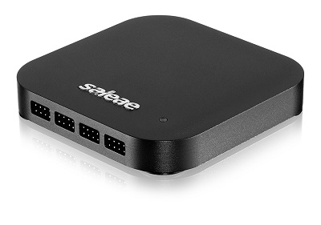

# Logic Analyzer Tutorial

Want to learn more about logic analyzers and how they work? Not sure what the difference is between oscilloscopes and logic analyzers? [Read through our logic analyzer tutorial here.​](https://articles.saleae.com/logic-analyzers/what-is-a-logic-analyzer)

