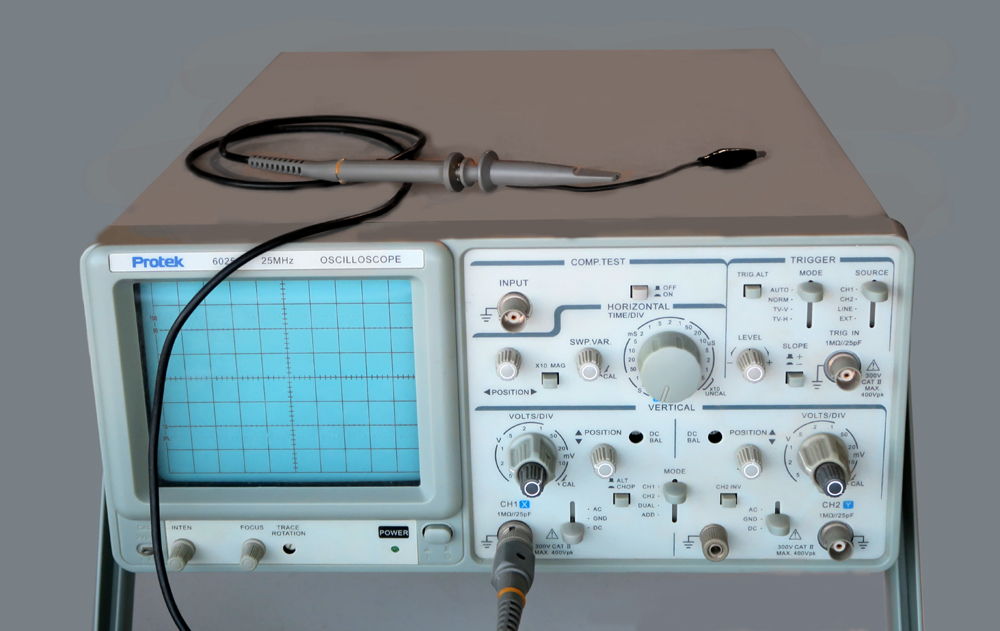

# Oscilloscope Tutorial

Want to learn more about oscilloscopes and how they work? Not sure what the difference is between oscilloscopes and logic analyzers? [Read through our oscilloscopes tutorial here.](https://articles.saleae.com/oscilloscopes/what-is-an-oscilloscope)

