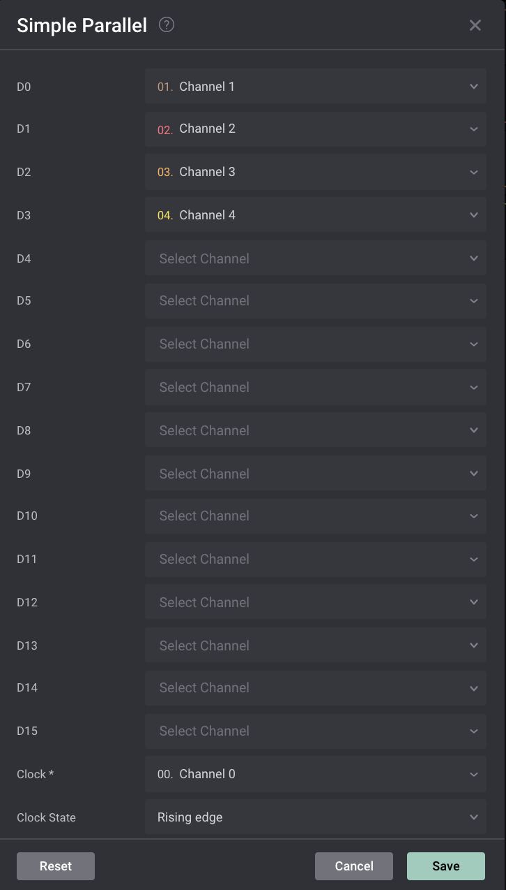

# Simple Parallel Analyzer - User Guide

The Saleae Logic software includes a protocol decoder to read clocked (synchronous) parallel bus data. The analyzer supports between 1 and 16 bits of data bus, although realistically, only 15 bits are possible due to the relance of a clock signal taking up one channel. The example image below shows a 4-bit data bus and a clock signal, which requires 5 channels.


### Decoding the Data

When using the Simple Parallel Analyzer, you will notice arrows and dots in the capture. You will also notice that the data is decoded above the Clock channel.

* **Arrows** - These represent when the sampling of the data bus takes place. In the example image above, we have set the Simple Parallel analyzer to treat data as valid on rising edges.
* **Dots** - The dots will be time-aligned with the arrows, and will give a representation of where data sampling takes place in the respective data bit channel.

An example is shown below for how a 4-bit data bus and a clock signal will be decoded using the Simple Parallel Analyzer. Note that the decoded data bubble (in this example, "0x0004") will always appear as a 16-bit hex number (i.e. 0x0000), even when a smaller data bus is decoded (in the case below, a 4-bit data bus).


Keep in mind that this isn't the "state" mode you may have seen in other logic analyzers. All Saleae units operate by over-sampling only and do not support a state/external clock mode. That means you will need to sample at least 4 times faster than the parallel clock frequency.

### Analyzer Settings

The settings for the parallel analyzer are described in this section. First, for all unused data bits, change the selected channel to "None". For instance, if you're using a 4-bit data bus, change D4-D15 to "None" in the settings as shown below.

<div align="center"></div>

Then, correctly assign the data bits you are using to the corresponding channels.

Finally, set the clock channel and the clock edge correctly and press Save.

### **Export File Format**

The protocol export will create a file using the currently selected display radix (hex demonstrated here). The export format has a header row and then 1 row per recorded parallel value. The values are the same as displayed in the displayed frames over the clock channel. There is one row per valid clock edge, either rising or falling, as specified in the analyzer settings.

Here is a sample of a file:

```
Time [s],Value
0.000020000000000,0x0000
0.000040000000000,0x0001
0.000060000000000,0x0002
0.000080000000000,0x0003
0.000100000000000,0x0004
0.000120000000000,0x0005
0.000140000000000,0x0006
```
