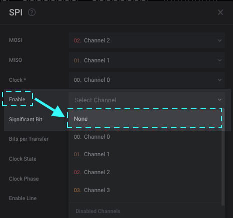

# SPI Analyzer - User Guide

The Saleae software includes a protocol analyzer for the Serial Peripheral Interface (SPI) bus.

SPI uses a Clock signal, two data signals (MISO and MOSI), and an Enable signal. That is the most common configuration of SPI, but other variants exist.

Our SPI analyzer is generic enough to decode basic synchronous serial (at minimum, a clock signal and a data signal) without the need for a second data signal or an enable signal. In cases like this, one of the data signals and the Enable signal can be disabled from within the analyzer settings.

### **Setup**

Add the SPI analyzer to your capture. There are a number of settings for the analyzer. First, select the channels you are using. If you are not using an enable signal or if you only have one data signal, simply set the unused channels to "None". Only clock and one data channel (either MISO or MOSI) are required for the SPI analyzer to operate.

Next, select the remaining settings you are using. If you are unsure what settings are used for the data you captured, you can either visually identify them or you can guess and check.

* MSB/LSB first. If you can't check which mode your data uses, you may need to guess.
* Bits per transfer. This is almost always 8 bits but can be set up to 64 bits.
*   Clock polarity

    &#x20; Clock polarity is basically the idle state of the clock in between SPI transactions. Whatever the idle clock state is when the enable signal becomes active, use this value (high or low).
*   Clock phase

    &#x20; Clock phase selects which edge the data is read on. Please note that leading and trailing do not correspond to rising and falling, which can lead to confusion. The leading edge is defined as the first edge on the clock signal after the enable line becomes active. If the clock is idle high, then the leading edge is the falling edge. If the clock is idle low, then the leading edge is the rising edge. This is the edge where data will be read from the data lines.&#x20;
*   Active low/active high enable

    &#x20; Only applies when an enable signal is used. Defines the state of the enable signal when the SPI analyzer will read the data signals.&#x20;

### **Multiple Devices / Enable Signals**

When you have multiple devices on the same SPI bus, you will have multiple enable signals, one for each slave device. To decode data from each slave device, simply add more SPI analyzers. It's perfectly fine for all SPI analyzers to share the same clock, the MISO, and MOSI signals. Note that the GUI will indicate that those channels are already in use, but that does not mean you can't use them.

**Different Settings for MISO and MOSI**

In some cases, you may want to have different settings between the two data channels. That can easily be done by using two SPI analyzers. Analyzers in the Saleae software have no limit to the number of analyzers that can share the same channels, so just add two SPI analyzers using the same clock, and enable channels. Then, on each analyzer, disable one of the two data channels.

SPI analyzer 1

* MOSI channel - MOSI input selected
* MISO channel - "none"

SPI analyzer 2

* MOSI channel - "none"
* MISO channel - MISO input selected

Then assign the settings you like to each analyzer.

### **Using the SPI Analyzer Without an Enable (Chip Select) Signal**

In many cases, there is no chip select signal available for an SPI bus that needs to be recorded.

The SPI analyzer included in the Saleae Logic software supports this case. In the event you record SPI data and there is no valid enable signal, simply change the "Enable" channel in the SPI analyzer settings to "None" as shown here:

### Solving Alignment Issues

In some cases (most commonly caused by ignoring the enable signal as described above), the analyzer will not decode the data correctly. That is because the SPI analyzer usually relies on the enable signal to align the data—that is, determine which bit of data should be the first bit in each byte and which bit should be the last.

Shown here is a typical issue where the alignment is off. You can clearly see that the pulses on the clock channel are in groups of eight—8 bits in each byte. There is a short gap between each byte.

However, even though the analyzer is decoding the data in groups of 8 bits, it is not starting on the correct bit. Instead, it is taking some bits from the end of the previous byte and adding them to the bits at the beginning of the next byte.

Here are the two most common causes of this:

* The logic analyzer started recording in the middle of an SPI byte.
* There are other erroneous transitions on the clock channel before the valid SPI data.

This is easy to fix. You will need to tell the SPI analyzer where the valid SPI data starts in the capture. The analyzer will then use that as the new starting point of the capture and decode data from that location.

Here's how this is done:

1. Place a timing marker just before the start of the first valid SPI byte.
2. Delete the data before the timing marker **(please note this cannot be undone)**. Instructions are provided in the support article below.


[delete-data.md](../../using-logic/delete-data.md)


## Logic 1.x

If using the older Logic 1.x software, the following information applies.

### Solving Alignment Issues

First, add the timing marker by clicking the A1 button on the right side of the screen. Then click on the graph at the location where you would like to place it, as shown here:

Next, open the SPI analyzer settings menu and select "Re-run starting at timing marker...". From that list, select the timing marker you just placed.

Screenshots:

After a moment, the SPI analyzer will automatically reprocess the capture. The data should now be aligned correctly, as shown here:

### **Other Common Issues**

A red square appears on the clock channel when the enable channel goes low. This can be accompanied by one of these messages: "The initial (idle) state of the CLK line does not match the settings" or "Settings mismatch" or "Error".

This occurs when the clock polarity setting is not set properly. For instance, in the image below, the clock channel is low while the enable signal is inactive. The correct setting should be "Click is low when inactive (CPOL=0)". In this case, the error is generated when "Clock is high when inactive (CPOL=1)" is selected. Simply swap the clock polarity and then double-check the clock phase to correct the issue.

