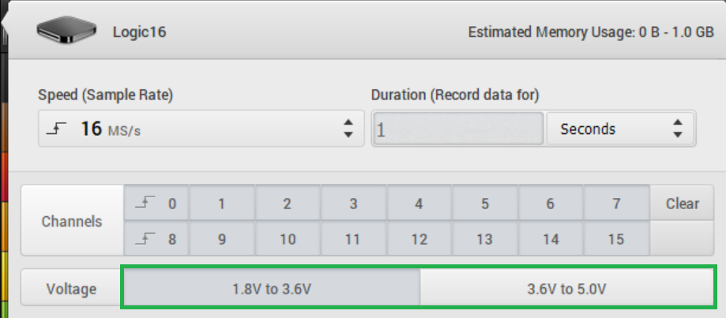

# Supported Voltages

There are two important specifications to keep in mind when determining what signals can be recorded with the Saleae products and what signals could potentially damage the device.

The first is the supported IO thresholds. These define the voltage thresholds that determine what is recorded as a digital 0 and a digital 1.

The second is the over-voltage protection. It determines the maximum input voltage that can be applied without risking damage to the device.

For all Saleae products, all inputs share the same IO threshold. For products with selectable thresholds, there is no way to assign different IO thresholds to different pins at the same time. All pins share the same threshold setting.

### A Note on Input Threshold Variation

There might be some small variation in the precise threshold voltage channel to channel. That is most notable in the Saleae Logic Pro devices because comparators with low hysteresis are used.

### **Logic 8**

The new Logic 8 has a fixed input voltage threshold.

* Voltage input low: 0.6 volts
* Voltage input high: 1.2 volts
* Over-voltage protection provides safety to +/- 25V

Notes:

* Over-voltage protection provides the same benefits as the other new devices, as listed in the notes for Logic 4.
* The 1.2V input voltage high spec allows Logic 8 to be used directly with the CAN low channel of 3.3V CAN.
* Recommended IO standards: 5.0V, 3.3V, 2.5V, 1.8V

### **Logic Pro 8 and Logic Pro 16**

Logic Pro devices have three selectable voltage threshold options.

The inputs are also implemented with comparators instead of standard CMOS buffers such as Logic 4 and the new Logic 8. That makes the input-low and input-high voltages very close to each other. The exact behavior of these comparators is not defined here.

* 1.2V Voltage Option

  * Voltage threshold: 0.6V

* 1.8V Voltage Option

  * Voltage threshold: 0.9V

* +3.3V Voltage Option

  * Voltage threshold: 1.65V
  * Use this option for all IO standards 3.3 volts or above.

* Over-voltage protection provides safety to +/- 25V

Notes:

* Over-voltage protection provides the same benefits as the other new devices, as listed in the notes for Logic 4.
* Recommended IO standards: 5.0V, 3.3V, 2.5V, 1.8V, 1.2V
* The precise threshold voltage is not calibrated and may vary as much as +/- 15%. That is more than accurate enough to record standard IO families.

### **Logic 4**

Logic 4 has a simple, fixed input voltage threshold.

* Voltage input low: 0.8V
* Voltage input high: 2.0V
* Over-voltage protection provides safety to +/- 25V

Notes:

* Over-voltage protection is sufficient to use this product safely with RS-232, RS-485, 12V TTL, and other larger swing signals inside the +/- 25 V range. No adapter or additional protection is required.
* Because of the voltage input high threshold of 2.0 volts, this device cannot be used with 1.8V or 1.2V logic. It also cannot be directly connected to 3.3V CAN signals. Please see our article about recording CAN for more details.
* Recommended IO standards: 5.0V, 3.3V, 2.5V

### **First-Generation Logic**

The original Logic also has a fixed input voltage threshold.

* Voltage input low: 0.8V
* Voltage input high: 2.0V
* Over-voltage protection provides safety to +/- 15V

Note: Over-voltage protection is not meant for continuous operation outside of -0.5V to 5.25V. That makes the device unsuitable for safe, direct recording of RS-232 and similar standards.

The original Logic is the only Saleae device to have internally pulled up inputs. All other Saleae devices had an internal resistance to ground. The original Logic's inputs float at about 2.4 volts, with over 100 K ohms of pull-up resistance, producing a very small pull-up effect.

### **First-Generation Logic16**


In the Logic 2 software, the voltage threshold is not yet selectable for Logic16. The menu selections for the two voltage settings currently do not work. This is on our backlog to fix. We will track our progress with this [here](https://ideas.saleae.com/b/feature-requests/bug-logic16-voltage-threshold-selection-not-working/).

In the meantime, if the voltage setting needs to be adjusted on your Logic16, we recommend using Logic 1.x for the time being until this is fixed in Logic 2. Sorry for the inconvenience with this.


## Logic 1.x

If you are using the older Logic 1.x software, the window for setting your voltage threshold setting will look different. You can refer to the images below if you are using this version of the software.

### Logic Pro 8/16 Voltage Setting in Logic 1.x

### Logic16 Voltage Setting in Logic 1.x

The original Logic16 had two selectable threshold settings.

* 1.8V to 3.6V Setting

  * Voltage input low: 0.7V
  * Voltage input high: 1.5V 

* 3.6V to 5.0V Setting

  * Voltage input low: 1.4V
  * Voltage input high: 3.6V

* Over-voltage protection provides safety to +/- 50V
  * Note: Over-voltage protection not meant for continuous operation outside of -0.9V to 6V. That makes the device unsuitable for safe, direct recording of RS-232 and similar standards.

