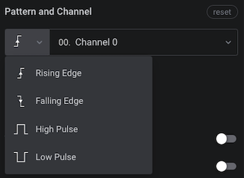
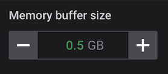

# Capture Modes

### Timer Mode

The timer mode is the simplest mode of data capture. A pre-defined duration is set by the user and the capture will end once the duration is reached. In the example video below, we set the capture duration to 5s. The recording will stop once 5s is reached.



### Looping Mode

The looping mode allows for a continuous recording into a RAM buffer, the size of which can be set by the user. Once the RAM buffer is filled, new data replaces old data in a FIFO method and the capture can continue indefinitely. When the capture ends, the data can be trimmed down to a certain length via the _Trim data after stopping_ setting, keeping the most recent data. 

In the example video below, we set the _Memory buffer size_ to 500 MB. Notice that, during the capture, the memory usage does not go above the set _Memory_ value of 500 MB during the continuous recording.



### Trigger Mode

The trigger mode will continuously record data until a digital trigger is found on a single channel. The four available types of digital triggers are Rising Edge, Falling Edge, High Pulse, and Low Pulse.

In addition to the edge/pulse trigger which is set on a single digital channel, you can require other digital channels to be either HIGH or LOW to trigger a capture.

While waiting for the trigger, the software will continue using the PC's RAM/memory until the "Memory buffer size" limit is reached. This setting is important, as the software will not exceed this limit. Please make sure to size the "Memory buffer size" appropriately from within the capture settings panel, such that your PC does not run out of memory while waiting for a trigger.

## Logic 1.x

If you are using the older Logic 1.x software, the following images and instructions apply.

### **Using the Trigger**

The trigger can be used to start capturing data after a specified digital event occurs. Two types of triggers are supported: Trigger on Edge and Trigger on Pulse Width. The trigger can be used to trigger on an event from any channel. To move the event trigger to a different channel, first remove it using the steps at the bottom of this page, and then add it to a different channel.

### **Trigger on Edge**

To trigger on an edge \(high to low, or low to high digital transition\), click the +Trigger button on the desired channel and select the positive or negative edge.

If desired, you can also require other channels to be either high or low during a previously selected edge. After selecting an edge, note that other channels will display a button with an "X" \(indicates "don't care"\).

To require a high or low, click this button and select high or low.

### **Trigger on Pulse Width**

You can also trigger on a pulse width condition where a particular channel is high or low for a specified amount of time.

To add a pulse width trigger, click the +Trigger button on the desired channel and select the positive or negative edge. Next, enter the desired time range to search for.

If desired, you can also require other channels to be either high or low during a previously selected pulse. After selecting an edge, note that other channels will display a button with an "X" \(indicates "don't care"\). To require a high or low, click this button and select high or low.

### **Start Searching for the Trigger**

After setting the trigger, you can click the _Start_ or _Start Simulation_ button to begin searching for the trigger. If and when the trigger condition is identified, data collection will start.

### **Skipping the Trigger**

You can skip the trigger by clicking "skip trigger" if you would like to force the capture to begin without the trigger condition being met.

### **Stopping the Capture**

If the trigger condition is identified, data collection will start. You can stop the capture at any point in time by clicking "Stop". This will stop the recording and will keep any data that has already been recorded. 

### **Searching with a Trigger**

After data have been collected, you can search for events within the data using the trigger. The trigger can be added or modified after data have been collected.

After the trigger has been set up \(see above\) and data have been collected, left and right arrows will appear next to the trigger button on the channel used for the edge or pulse width condition. Click these arrows to advance to sections of the data that satisfy the trigger condition.

### **Turning Off the Trigger**

To remove the trigger, deselect the trigger type button, or use the reset button.

