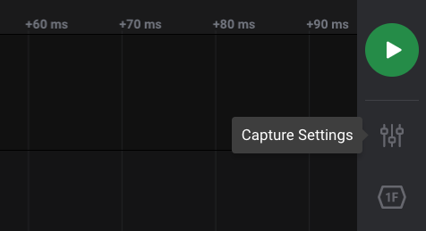

# Capture Settings

The Capture Settings Panel can be opened up by clicking on the Capture Settings icon located on the software's side panel on the right.

From this panel, several settings can be configured, such as:

* Digital Channels
* Digital Sampling Rate
* Digital Voltage Setting
* Analog Channels
* Analog Sampling Rate
* Preset Saving/Loading
* Capture Modes \(Looping, Timer, & Trigger\)
* Capture Mode Specific Settings
* Trim
* Glitch Filter
* Memory Buffer Size

Our tutorial video below demonstrates setting some basic settings such as enabling/disabling channels, settings the sampling rate and voltage, and specific settings related to the _Timer_ capture type.



### Channels & Sampling Rate

Individual digital and analog channels can be enabled and disabled as needed. In addition, the sampling rate for digital and analog channels respectively can also be adjusted. 



Please note that changing these settings may affect the available sampling rates for other channels. This is due to the total amount of available bandwidth that our logic analyzers can support. When this happens, you will receive a popup about the sampling rate change like shown below.



### Digital Voltage Setting

Logic Pro 8, Logic Pro 16, and our Original Logic16 all feature adjustable voltage thresholds, which can be set via the voltage dropdown setting next to the digital sampling rate setting. The _3.3+ Volts_ setting, for example, will set the voltage threshold to half that value, or 1.65 V. Our other logic analyzer models have a fixed voltage threshold, and therefore do not have this setting. For more information on the voltage setting options and thresholds, see our support article on this below.



### Capture Settings Presets

Capture settings presets can be saved and loaded locally as needed by clicking on the Presets button at the top-right of the Capture Settings panel.



To share your presets with others, you can export your preset and import it into a new PC. Click on the 3 dots to the right of your preset to open up the options menu for that preset. This will allow you to load, rename, export, or delete you preset. To import a preset, click the _Import_ button at the bottom of the Presets window.

### Capture Modes - Looping, Timer, & Trigger

For more information on the available capture modes and their specific settings, see the support article below.



### LED Settings and Color


Unfortunately this feature is not available in the newer Logic 2 software. If you need this feature, please vote on it [here](https://ideas.saleae.com/b/feature-requests/change-the-led-color-on-the-unit/)!


## Logic 1.x

If you are using the older Logic 1.x software, you can follow the instructions below.

### Collecting Data

To start collecting data, press the _Start_ button. 

After the capture has started you can stop it before it finishes if you like - this will retain the data to that point.

If the Start button is gray and cannot be clicked, that means you are not on the capture tab. Look at the bottom of the window, and on the left, you should see the capture tab. Click that tab and then take your capture.

If the _Start Simulation_ appears instead of _Start_, it means the Logic hardware is disconnected.

If the software incorrectly reports _Disconnected_, please follow this troubleshooting guide.



### **Device Settings**

To access device settings, click the up or down arrow in the top-left of the software. To close the Device Settings, click on something outside the popover. The Device Settings pop-up consists of the following sections.


The device settings may be different depending on the Saleae Logic model that is connected. The example here is for Logic Pro 8. Notes on these differences are provided below.


1. **Estimated Memory Usage** 

   * This will be displayed when more than 1 GB of RAM is expected to be used by the software. This will depend on the capture settings below. Digital data is compressed and no additional memory is used when using a faster sampling rate. Rather, memory usage is proportional to the number of transitions in the digital data. Analog data is not compressed and consumes roughly 4 bytes per sample. At 50Msps, that’s 200MB per second, per channel.

2. **Speed \(Sample Rate\)** 

   * The sample rate dropdown lets you select how fast to sample data—how many times per second your signal is measured. The available options depend on your device, the channels being used, and the performance level selected.

   \*\*\*\*

3. **Duration** 

   * Enter the duration of your capture.

4. **Digital Channels** 

   * Enable and disable the digital channels you would like. You can click and drag over the control to change a number of channels at the same time.

5. **Analog Channels** 

   * Enable and disable the digital channels you would like. You can click and drag over the control to change a number of channels at the same time.
   * _Note:_ Not all devices have selectable channels. The original Logic does not have selectable channels, and Logic 4 only allows you to enable or disable the analog input. The digital channels are always enabled. You can switch the analog channel on and off by selecting sample rate options with and without analog sample rates.

6. **Voltage** 

   * Edit the voltage level of your digital signals. This affects the voltages at which an input is considered a one or a zero.
   * _Note:_ Logic Pro 8, Logic Pro 16, and the original Logic16 are the only devices with adjustable thresholds. See the PDF Users Guide, Specifications, and Data Sheets to find what voltage options are available for each device.

7. **Performance** 

   * Not all computers or USB host controllers will be able to capture at top speed. If that happens, you can throttle back the performance setting with this control. It will update the sample rates that are available.
   * _Note:_ The performance control is only available when analog and digital channels are enabled at the same time. When sampling digital only or analog only, slower sample rates will be available from the sample rate dropdown, which will reduce USB throughput.
   * _Note:_ Logic 4 is the exception to this. It will not display a performance selector even when recording analog and digital channels at once. All possible sample rates are always available in the dropdown.

   \*\*\*\*

8. **Device** 
   * While no Logic hardware is connected, you can select a device to simulate. There is no option to simulate our discontinued products. If you have more than one Logic attached, you can toggle between them here. You also can control the LED color by clicking the gear icon.

### **LED Settings and Color**

You can enable/disable the LED, or change its color, here - just click the gear icon. 

### **Closing the Device Settings Popover**

To close the Device Settings, click on something outside the popover.

### **Digital Trace Colors**

For easy of readability, the digital trace color can match the channel color. To set this, click _Options -&gt; Preferences -&gt; Interaction tab -&gt; Use color_. 

