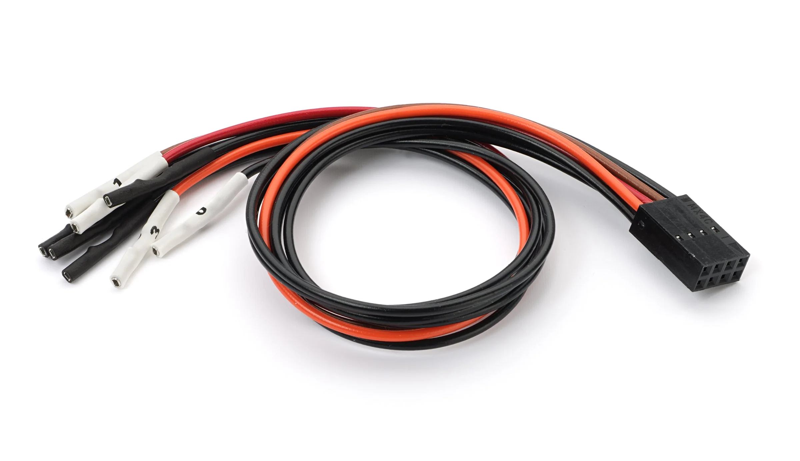
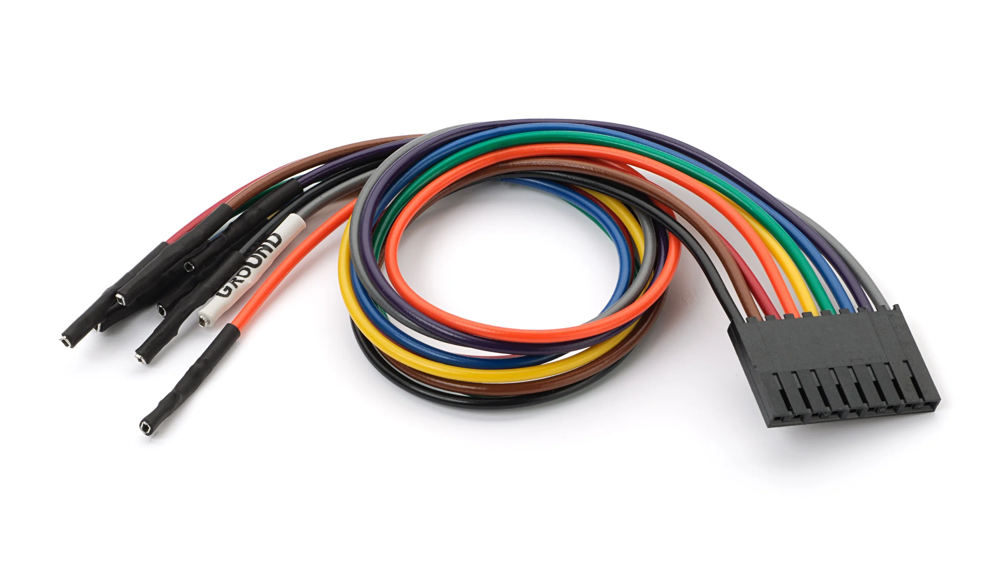

# Logic Accessories

The following accessories and instructions apply to the following Saleae Logic products - Logic 4, Logic 8, Logic Pro 8, and Logic Pro 16.

### **Wire Harness (Gen 2 Version)**

A 2x4 wire harness is used by Logic 4, Logic 8, Logic Pro 8, and Logic Pro 16, which are our 2nd-generation logic analyzers.

<figure><figcaption>
2x4 Wire Harness
</figcaption></figure>

### **Connecting the Wire Harness**

If you have Logic 4, Logic 8, or Logic Pro 8/16, then you have one or more 2x4 wire harnesses. The four black leads are ground and should be on the bottom. The four colored leads are the signal inputs and should be on the top. There is an indication of this orientation on the back of the device.

<figure><figcaption>
Connecting the Wire Harness
</figcaption></figure>

Note that the test lead color matches the channels in the software. The colors reflect the resistor color code for numbers 0–7. The numerical channel number is on the white heat shrink at the ends of the leads. The lead ends are made up of the following parts:

* [Molex 0016020086](https://www.molex.com/pdm\_docs/sd/016020086\_sd.pdf) crimp connectors (for typical .100-inch spaced headers/pins)
* [Molex 0022552081](https://www.molex.com/pdm\_docs/sd/022552081\_sd.pdf) plastic housing (2x4 - 2.54mm/.100in pitch)

### **Connecting the Ground Pins**

The 2x4 harness has a ground lead for each channel. When signal integrity is a concern (e.g., working with high-speed digital or analog in the presence of cross-talk sources), connect a ground for each channel. Connect noisy digital inputs to leads as far as possible from leads connected to sensitive analog measurements.

Note that the ground leads are shorted internally. Therefore, when signal integrity is not crucial, only one ground lead needs to be connected to your device under test at a minimum, while the rest of the ground leads can be left floating.

### **Test Clips**

All Logic products come with enough test clips for every test lead. These test clips have two metal pins that can be inserted into the connector at the end of each test lead. Only one of the metal pins needs to be connected to a single test lead connector.

<figure><figcaption>
Connecting the Test Clip(s)
</figcaption></figure>

### **Connecting to Headers**

If your PCB has .100-inch headers that break out signals you need to examine, you can connect the test leads directly to these pins.

### **Ultra-Fine Pitch and Other Difficulties**

In many situations, it may be difficult to connect Logic directly to your signal. Generally, in these situations, you'll want to solder a wire (typically wire-wrap wire) to an exposed pin, trace, or via, and then use Logic's test clip to connect to that wire. Alternately, you can invest in some extremely small pitch test clips such as these: [Test clips - Grabbers, Hooks](https://www.digikey.com/products/en/test-and-measurement/test-clips-grabbers-hooks/620?k=micro%20gripper)

## Gen 1 Logic Accessories

The following accessories and instructions apply to our Gen 1 products - Original Logic and Logic16.

### Wire Harness (Gen 1 Version)

A 1x9 wire harness is used by the Original Logic and Logic16, which are our 1st-generation products.

<figure><figcaption>
1x9 Wire Harness
</figcaption></figure>

### **Connecting the Wire Harness**

If you have the original Logic or Logic 16, then you have one or more 1x9 wire harnesses. These harnesses are colored according to the resistor color code for 0–7. The colors match the channel colors in the software. The ground wire is grey and has a GROUND label on the white heat shrink. Turn the device over for a ground symbol, and make sure the grey test lead aligns with this symbol.

<figure><figcaption></figcaption></figure>

### **Signal Integrity with the Gen 1 Harness**

When using Logic16 with more than 8 inputs, we recommend connecting the second ground line, especially if using higher voltages (5V). That will help reduce cross-talk during any simultaneous switching events.

### Community Created Accessories

Several Logic accessories have been made available by our community of users. These are listed in the support article below.


[community-created-accessories.md](../../community/community-created-accessories.md)


