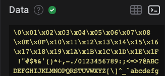

# Data Table & Terminal View

## Data Table

### Overview

The analyzer data table shows all decoded protocol data in a table format. In general, the search functionality allows you to search for content in any column, except for the 'Start' and 'Duration' columns.

To learn more about the different columns that are used for Saleae's built-in analyzers, please refer to the support article below.


[analyzer-frame-types](../../extensions/analyzer-frame-types/)


### Excluding Analyzers and Columns

By clicking the 3 dots to the right of the search bar, a few options become available.

* Analyzers can be added or removed to exclude certain analyzers from search results and from appearing in the Data Table.&#x20;
* The ability to exclude columns from search become available (while keeping them visible in the Data Table). This is useful for excluding columns that may otherwise pollute your search results, such as the 'Type' column, or boolean columns like 'ack' or 'read'.

### Show/Hide Columns

The ability to hide columns altogether is available by right clicking the column label in the Data Table.

This also excludes them from the search results and is useful when there are too many columns to comfortably display.&#x20;

### Other Notes

* The data table respects your display radix selection for each analyzer, including high-level analyzers.
* When searching, matching cells will be highlighted, and the matching section of the contents will also be highlighted.

### Jumping to a Data Table Row from the Waveform

You can jump to a specific row in the data table by hovering your mouse over a decoded bubble above the waveform as shown in the image below. A keyboard shortcut (OS-specific) will appear to allow you to perform this action.

### Data Table Scrollbar Limitations

Currently, the contents of the data table are loaded dynamically depending on which section of the data table is currently in view. This approach has some drawbacks which are especially noticeable when navigating the data table with the scrollbar.&#x20;

For example, dragging the scrollbar to the bottom will not immediately jump you to the end of the data table. Instead, new data table rows will be loaded dynamically, and the scrollbar position and size will adjust accordingly. Therefore, the scrollbar will not be scaled correctly with reference to the total count of data table rows.

Workarounds:

* The End and Home keys can be used to instantly jump to the end or beginning of the data table respectively.
* You can jump directly to a data table row from the waveform. Details on this are described in a section of this support article above.

In case this is something you'd like us to improve, please vote for [this feature request](https://ideas.saleae.com/b/feature-requests/vertical-scrollbar-for-the-analyzer-data-table-view/)!

### Search Limitations

In most cases, you should be able to search for what you see in the table, just as you would search any other document, spreadsheet, or website. However, in order to improve performance of the search functionality, the search function has a few limitations.

In general, the search system is case-insensitive. If you would like to use case-sensitive search, please support [this feature request](https://saleae.upvoty.com/b/feature-requests/add-option-to-make-analyzer-data-table-search-case-sensitive).

Limitations:

* The 'Start' and 'Duration' columns can't be searched.
* when searching data shown in hexadecimal or binary, searching for a hex or binary number starting with '0x' or '0b' will force the search to match the beginning of the number. However, searching for '0', 'x', or '0x' by itself will not match the hex or binary prefix. This is a departure from the normal "search for what you see" functionality, but will eliminate accidental searches which may match with all rows of an analyzer.
* when searching a byte array data type (like MISO, MOSI, and many other analyzer result types) that are displayed in the ASCII display radix, you may see dot characters ('.') in positions where the data isn't a displayable ASCII character. These characters cannot be searched for. Only ASCII characters can be searched. For example, if a cell displays 'ab...yz' you can search for 'a', 'b', 'ab', 'y', 'z', and 'yz' to match it, but you can't search for 'ab...yz' because the dot ('.') characters are unmatchable.

### Display Radix Information

The new data table has a few different column types:

* Integer
* Double precision floating point
* Boolean
* String
* Byte array

Once an analyzer has been added, the user can change the display radix for that analyzer by right-clicking it in the analyzers panel in the sidebar.

The data table respects the users selected display radix. The display radix options are hexadecimal, ASCII, decimal, and binary. However, not all data types support each radix.

This list explains the supported radix of each data type.

| Column Data Type | Example Value      | Hex                | ASCII       | Decimal     | Binary                                                             |
| ---------------- | ------------------ | ------------------ | ----------- | ----------- | ------------------------------------------------------------------ |
| Integer          | 42                 | 0x000000000000002A | 42          | 42          | 0b0000000000000000000000000000000000000000000000000000000000101010 |
| Float            | 3.14159            | 3.14159            | 3.14159     | 3.14159     | 3.14159                                                            |
| Boolean          | true               | true               | true        | true        | true                                                               |
| String           | "hello world"      | hello world        | hello world | hello world | hello world                                                        |
| Byte Array       | \[0x48, 0x69, 0x0] | 0x486900           | Hi\0        | 72 105 0    | 0b1001000110100100000000                                           |

## Terminal View

A terminal view is available by clicking the "Terminal" button at the top-right of the data table. This allows you to view your data in a terminal-like display format.

### Limitations of Terminal View

#### Terminal Output is not in Time Order

Currently, our terminal view does not output results in time order if more than one analyzer is outputting data to the terminal. Instead, our terminal view will group the output results by analyzer. We've received requests for adding support for ensuring time order when using multple analyzers. Please feel free to share your feedback on this in the feature request post here: [Feature Request - Terminal Messages to be Timeline Ordered](https://ideas.saleae.com/b/feature-requests/terminal-messages-to-be-timeline-synced/)

#### Scroll-back Limit

Our in-app terminal view has a scroll-back limit of 10,000 rows. Once the 10,000 row limit is reached, the oldest rows are deleted. However, starting version 2.4.4, we added an experimental environment variable override to specify longer terminal scrollback limits.

* `set SALEAE_SCROLLBACK_LIMIT=1000000` for Windows
* `export SALEAE_SCROLLBACK_LIMIT=1000000` for MacOS and Linux

#### Radix Display within the Terminal

* **Async Serial** - will always attempt to display in ASCII format. If the ASCII opcode doesn't exist, then it will be displayed in hex, separated by backslashes (\\) as shown below. Notice that the first set of opcodes (0 to 0x1F) do not exist and are therefore displayed as hex. As the opcode increments and become valid, ASCII characters are displayed.

* **I2C** - will display addresses and data, as well as read/write status, as shown below.

* **SPI** - will display in hex in the format `MOSI / MISO` .

* **For all other analyzers** - content will be displayed as shown in the data table.

#### Terminal RefIow issue when Panel is Resized

This only affects the last line in the terminal, and is noticeable when resizing the side panel.&#x20;

For Async Serial - The last line will not text wrap properly. The last line is considered as the final stretch of data preceded by a new line or carraige return. For I2C or SPI - the last line is considered after the end of a previous transaction, and will not properly reflow when the side panel is resized. SPI data looks like it completely disappears.

We use xtermjs for our in-app terminal. According to the xtermjs GitHub issue link below, this seems to be a bug that only affects the last line of text.



If you're running into this issue, please vote/comment on our [idea post here](https://ideas.saleae.com/b/feature-requests/bug-terminal-text-doesnt-reflow-properly-when-panel-is-resized/), which we are using to track this bug.

#### Terminal Text Seems to be Missing

Our intention was for the terminal to respond appropriately to '\r' (CR, carriage return) and '\n' (LF, line feed) when encountered in the serial analyzer data, to help make the terminal work like a serial terminal. Having said that, serial data that only outputs '\r', but not '\n', will cause terminal text to get deleted since the missing '\n' is not moving the cursor one line forward.

To work around this in the meantime, we have released an extension via our Extensions Marketplace called "Carriage Return to Line Feed Converter."

<figure><figcaption>
Carriage Return to Line Feed Converter Extension
</figcaption></figure>

