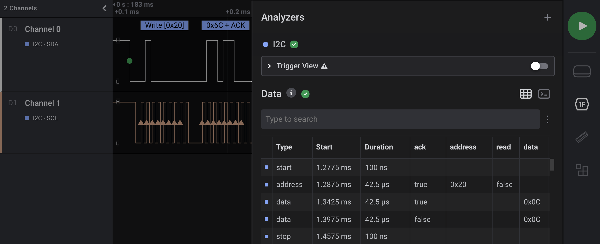
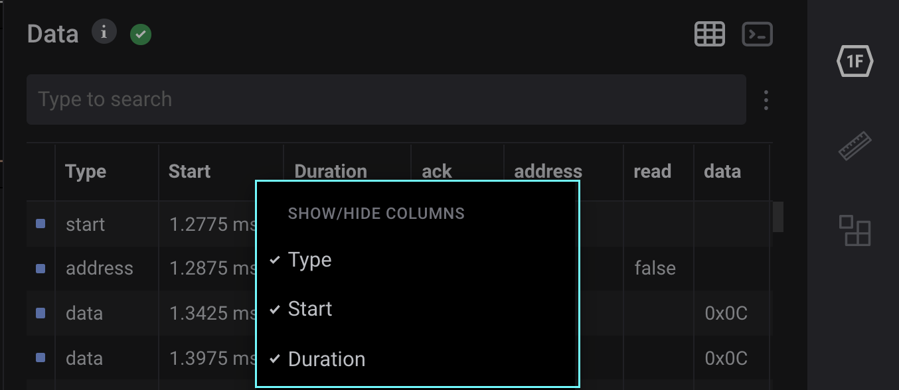
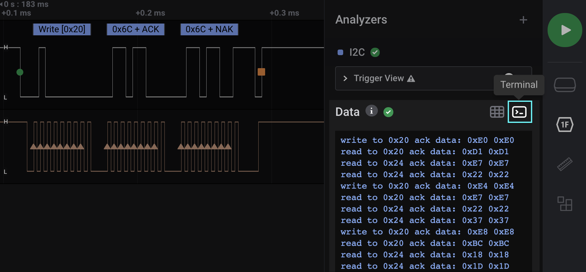

# Data Table & Terminal View

## Data Table

### Overview

The analyzer data table shows all decoded protocol data in a table format. In general, the search functionality allows you to search for content in any column, except for the 'Start' and 'Duration' columns.

To learn more about the different columns that are used for Saleae's built-in analyzers, please refer to the support article below.



### Excluding Analyzers and Columns

By clicking the 3 dots to the right of the search bar, a few options become available.

* Analyzers can be added or removed to exclude certain analyzers from search results and from appearing in the Data Table. 
* The ability to exclude columns from search become available \(while keeping them visible in the Data Table\). This is useful for excluding columns that may otherwise pollute your search results, such as the 'Type' column, or boolean columns like 'ack' or 'read'.

### Show/Hide Columns

The ability to hide columns altogether is available by right clicking the column label in the Data Table.

This also excludes them from the search results and is useful when there are too many columns to comfortably display. 

### Other Notes

* The data table respects your display radix selection for each analyzer, including high-level analyzers.
* When searching, matching cells will be highlighted, and the matching section of the contents will also be highlighted.

### Jumping to a Data Table Row from the Waveform

You can jump to a specific row in the data table by hovering your mouse over a decoded bubble above the waveform as shown in the image below. A keyboard shortcut \(OS-specific\) will appear to allow you to perform this action.

### Search Limitations

In most cases, you should be able to search for what you see in the table, just as you would search any other document, spreadsheet, or website. However, in order to improve performance of the search functionality, the search function has a few limitations.

In general, the search system is case-insensitive. If you would like to use case-sensitive search, please support [this feature request](https://saleae.upvoty.com/b/feature-requests/add-option-to-make-analyzer-data-table-search-case-sensitive).

Limitations:

* The 'Start' and 'Duration' columns can't be searched.
* when searching data shown in hexadecimal or binary, searching for a hex or binary number starting with '0x' or '0b' will force the search to match the beginning of the number. However, searching for '0', 'x', or '0x' by itself will not match the hex or binary prefix. This is a departure from the normal "search for what you see" functionality, but will eliminate accidental searches which may match with all rows of an analyzer.
* when searching a byte array data type \(like MISO, MOSI, and many other analyzer result types\) that are displayed in the ASCII display radix, you may see dot characters \('.'\) in positions where the data isn't a displayable ASCII character. These characters cannot be searched for. Only ASCII characters can be searched. For example, if a cell displays 'ab...yz' you can search for 'a', 'b', 'ab', 'y', 'z', and 'yz' to match it, but you can't search for 'ab...yz' because the dot \('.'\) characters are unmatchable.

### Display Radix Information

The new data table has a few different column types:

* Integer
* Double precision floating point
* Boolean
* String
* Byte array

Once an analyzer has been added, the user can change the display radix for that analyzer by right-clicking it in the analyzers panel in the sidebar.

The data table respects the users selected display radix. The display radix options are hexadecimal, ASCII, decimal, and binary. However, not all data types support each radix.

This list explains the supported radix of each data type.

| Column Data Type | Example Value | Hex | ASCII | Decimal | Binary |
| :--- | :--- | :--- | :--- | :--- | :--- |
| Integer | 42 | 0x000000000000002A | 42 | 42 | 0b0000000000000000000000000000000000000000000000000000000000101010 |
| Float | 3.14159 | 3.14159 | 3.14159 | 3.14159 | 3.14159 |
| Boolean | true | true | true | true | true |
| String | "hello world" | hello world | hello world | hello world | hello world |
| Byte Array | \[0x48, 0x69, 0x0\] | 0x486900 | Hi\0 | 72 105 0 | 0b1001000110100100000000 |

## Terminal View

A terminal view is available by clicking the "Terminal" button at the top-right of the data table. This allows you to view your data in a terminal-like display format.

### Limitations of Terminal View

* Our in-app terminal view has a scroll-back limit of 10,000 rows. Once the 10,000 row limit is reached, the oldest rows are deleted.
* Radix display in the terminal is limited to ASCII only. Viewing data in other radices is only available from within the Data Table at the moment.

