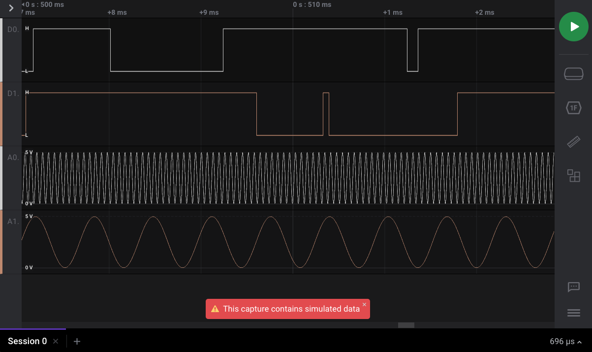
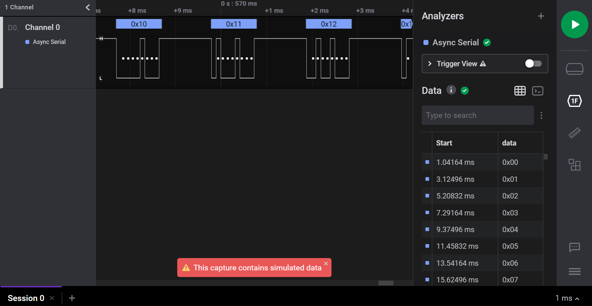

# Demo Mode

When a Saleae Logic device is not connected to the PC while the Logic 2 software is running, an option is provided to run the software in Demo Mode. This allows users to test the capabilities of the software without having to own our logic analyzer.


In this mode, when a data capture is run, randomly generated simulation data will populate the recording as shown below.



### Generating Analyzer Simulation Data

By default, when an analyzer is added to digital channels while in Demo mode, the simulation data on those digital channels will continue to contain random transitions and will not contain analyzer-specific data.

In order to generate analyzer-specific simulation data, you can run the following commands in the command line to open the software with simulation data enabled for analyzers.

#### Windows

This is assuming the Logic2 app is installed under Program Files.

```text
set ENABLE_SIMULATION=1
cd C:\Program Files\Logic
Logic.exe
```

#### MacOS

This is assuming the Logic2 app is located on your Desktop.

```text
export ENABLE_SIMULATION=1
cd Desktop/Logic2.app/Contents/MacOS
./Logic
```

#### Running the Demo Capture

Once the software is run in this manner, the proper simulation data for added analyzers will be generated when running a demo capture as shown below.



#### Why are the extra steps required?

The commands `export ENABLE_SIMULATION=1` and `set ENABLE_SIMULATION=1` will set an environment variable that lasts just for that terminal session. Other terminals won't see it, and when you close that terminal, the setting will be reset. Any application started from that terminal after that environment variable was set will see that variable and run accordingly.

The reason we added this is because we simply haven't tested this feature completely yet. Ideally, once we fully verify that this works properly, we plan to enable this setting by default. Until then, feel free to [contact us](https://contact.saleae.com/hc/en-us/requests/new) if you run into any issues with this!


## Logic 1.x

If you are using the older Logic 1.x software, the following images and instructions apply.

When the software is not connected to a Saleae Logic device, it switches into simulation mode so potential users can explore the features of the software before deciding to buy the unit.

In simulation mode, the title bar will say _\[Disconnected\]_ and the green button will say _Start Simulation_. 


When you click Start Simulation, the capture will proceed, and the results will contain data that appear to transition randomly.


### **Simulating Protocol Analyzer Data**

If any protocol analyzers were added to the session before the simulation mode was run, then clicking _Start Simulation_ will generate valid protocol data. This is useful to demonstrate the functionality of each protocol analyzer, without having to record real protocol data using the Logic hardware. In the example below, we have added an the _Async Serial_ Analyzer to Channel 0. Afterwards, clicking _Start Simulation_ will generate serial data as shown.


