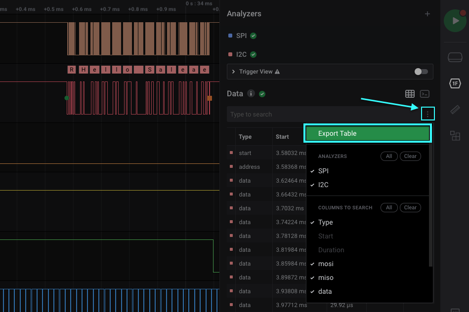
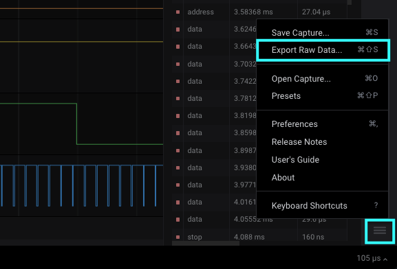
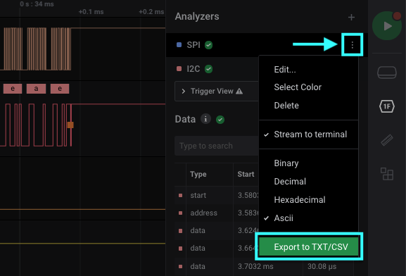

# Exporting Data

### Exporting the Data Table

In addition to exporting individual analyzer results, the Logic 2 software also allows exporting of the entire Data Table, which can include entries from all of your added analyzers. To export the Data Table, click the 3 dots to the right of "Data," then click "Export Table."

### Exporting Raw Data

To export raw data from your capture, click the Options button at the bottom right of the software, then click "Export Raw Data."

You will be greeted with an "Export Raw Data" window. From here, you can select the channels you would like to include in your export, the time range, and the export format \(currently, Logic 2 supports CSV and Binary exports\).


Note: Digital channel entries are only recorded in the export file when data changes. Therefore, the number of entries in the resulting export file are dependent on the number of transitions that occur and not on the number of digital samples in the capture. This helps reduce the file size of the export file.


### Exporting Analyzer Results

To export your individual analyzer results, click the 3 dots next to the particular analyzer you'd like to export data for. Then click "Export to TXT/CSV." You will be greeted with an OS prompt to save your export file.

### 

## Logic 1.x

If you are using the older Logic 1.x software, the following images and instructions apply.

### **Exporting Analyzer Results**

To export the results of a particular protocol analyzer, click the gear button on that analyzer and select Export as text/csv file.

To export more than one protocol analyzer or only results that match your search, click the gear button on the Decoded Protocols panel and select Export search results.

### **Exporting Raw Data**

If you need to view, manipulate, or process data in another application, you can export it.

To begin exporting, click the Options button at the top right of the software and select Export data. When exporting data, you can select which channels to export and over what time period. Finally, you can select the format of the exported data.

**Exporting Raw Data - CSV Format**

CSV format is a text format suitable for opening in a spreadsheet application or loading from a script. You can choose to include column headings and choose commas or tabs as the delimiter.

When exporting digital data only, you can choose to use timestamps or sample numbers to output the digital as a single value or as a bit per column. You can choose to record only when the value changes or record every sample.

**Exporting Raw Data - VCD Format**

VCD stands for value change dump. It is a text-based format used for saving digital data \(it can't be used with analog data\).

**Exporting Raw Data - Binary Format**

A binary format is provided primarily for those interested in loading data into a script or custom application. You can choose to export every sample or only record when the value changes. You can also select the number of bytes used per sample.

**Exporting Raw Data - MATLAB Format**

To use data in MATLAB, you can export a .mat file, which can be loaded by MATLAB.

**Exporting Raw Data - Additional Notes**

Some export formats have different options when exporting a mix of digital and analog channels or exporting only analog channels. Not all export options are available in some cases.

CSV can be used to export digital channels, analog channels, or a mix of digital and analog channels. Different options are available for each of these cases, and the format varies slightly. For instance, when exporting just digital channels with CSV and in one row per change mode, there will only be one set of timestamps in the file. When exporting digital and analog data, one row per change mode is the only format for the digital component, but timestamps are created for each channel individually instead of being shared between all digital channels. This special "mixed mode" export feature is not available unless at least one analog channel is present in the export. The only way to accomplish this for digital-only exports is to export each channel, one at a time, to separate files.

Binary export can be used for digital exports and analog exports, but it cannot be used to export a mix of analog and digital channels in the same file.

VCD only supports digital channels.

Matlab supports exporting digital channels, analog channels, and a mix of analog and digital channels.

