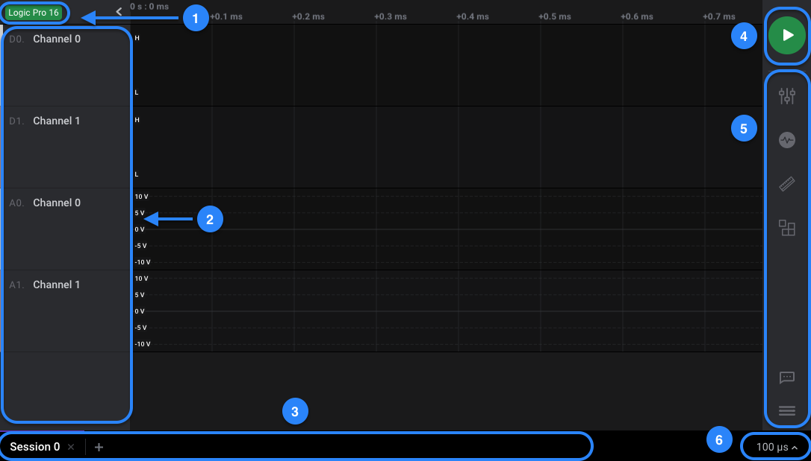

# Navigating the Software

The Logic 2 software consists of the following basic sections:

### 1. Logic Analyzer Connection Status

This button allows you to check your logic analyzer's connection status with the software. Clicking it will allow you to view device information such as the device type, serial number, and calibration status.



### 2. Enabling and Disabling Input Channels

Any enabled input channels are shown here. Use the Capture Settings panel to enable or disable channels.



### 3. Adding & Renaming Session Tabs

Click the "+" button to create new capture sessions tabs. This can be useful to manage multiple captures. To rename a tab, click the text within the tab.

### 4. The Start Button

Click the green "Start" button to begin a data capture. 

* If a logic analyzer is not connected, this button will generate simulation data as if a logic analyzer was collecting real world data. 
* If a logic analyzer was connected, then this would begin capturing data from its enabled input channels. After the capture has started, you can stop it before it finishes, which will retain the data to that point. 

### 5. Side Panel Buttons

The side panel buttons offer various ways to configure your logic analyzer settings. More information on these settings can be found in the articles below.









### 6. Time Scale Adjustment

The time scale for the displayed waveforms can be adjusted to an exact time value per 100 pixels as shown below. This gives the ability to set an exact zoom level, as opposed to using the mouse scroll wheel or using keyboard shortcuts to zoom in and out.



### Other Useful Features

Several more useful tasks can be performed from the main software view, such as...

* Renaming Channels
* Reordering, Resizing, & Scaling Channels
* Editing Colors

These features are described in our tutorial video below about organizing your workspace.



## Logic 1.x

If you are using the older Logic 1.x software, you can follow the instructions below.

This section will guide you through the features of the Logic software. This is a great first step to take to familiarize yourself with the features of the software. When no Logic device is connected, the software will work in demo mode, which is virtually identical to how it will function when a device is connected. The demo will help you become familiar with the software before your Logic device arrives.

### **Navigating the Logic Software**

The Logic software user interface consists of the following basic sections.

1. _**Start Simulation**_ **or** _**Start**_ **Button** 

   * Generates simulation data, as if the logic analyzer was collecting real world data. If a Saleae Logic was connected to the PC, then this button would say Start. After the capture has started, you can stop it before it finishes, which will retain the data to that point. If the Start button is gray and cannot be clicked, that means you are not on the capture tab \(_See \#4_\). Ensure you are on the capture tab so you can take a capture.

2. **Device Settings Button** 

   * Opens the Device Settings window. This window allows you to modify capture settings, such as sampling rate, capture duration, enabled channels \(digital and analog\), voltage, and performance.

3. **Options Button** 

   * Opens system-wide settings for the Logic software, which allows you to save captures, export data, and modify various settings for the Logic software.

4. **Capture tab** 

   * You can save previous captures so you can refer to it later.
   * The Capture tab is your current capture. 
   * The &gt;&gt; button allows you to save the current capture into a new tab. 
   * The _gear_ icon on the previously saved capture tabs allow you to close or copy the tab.

5. **Enabled Channels** 

   * Currently enabled channels are shown here. Use the Device Settings button to enable and disable channels \(_See \#2_\). If a channel is enabled but cannot be seen, it may be hidden. Click the _gear_ icon on any of the channels and click _Reset All Channels_ to reset all channel settings and bring them all back into view.

6. **Software Version and Logic connection status**

   * If status is \[Disconnected\], the green button will display _Start Simulation_
   * If status is \[Connected\], the green button will display _Start_

   \_\_

7. **Annotations, Analyzers, and Decoded Protocols**
   * The Annotations window lets you add bookmarks, timing markers, and various measurements to your capture.
   * The Analyzers window lets you add one of our many protocol analyzers to your digital channels. The _+_ icon will only be clickable if there are digital channels enabled.
   * The Decoded Protocols window shows the decoded results of the protocol analyzers once the capture is complete and the data has been processed.

### **Renaming Tabs**

To edit the text shown on a tab, click the text.

### **Rearranging Channels**

To rearrange channels, drag them by their grip icon at the far left of the channel.

To drag more than one channel, select the first channel by clicking anywhere in the channel label area.

  

Then control-click additional channels, selecting them as well. You can use shift-select to select a range of channels.

Then drag one of the channels by its grip icon. All the selected channels will move together.

To reset the channel order, click the channel settings icon \(gear\) on any channel and select Reset All Channels.

### **Changing Channel Size**

To change the channel size, click the channel settings icon \(gear\) on the desired channel and select a new size.

 

To change multiple channels to the same size, select them \(control-click\) and then set one of the selected channel's size. All the selected channels will change their size.

To select all channels, select one and then press CTRL-A.

### **Hiding Channels**

To hide a channel, click the channel settings icon \(gear\) and select Hide Channel.

You can hide multiple channels at the same time by selecting multiple channels and then selecting Hide Channel on one of them.

To restore this and other hidden channels, click on a channel's settings icon and select Reset All Channels.

### **Editing Channel Labels**

By default, channels are labeled Channel N where _N_ is the channel number. To make it easier to remember which channel is connected to what, these labels are user-editable.

To change a channel label, first click anywhere over the existing label name.

This will switch the label into the editing mode. Use the next box to change the channel label to whatever text you prefer.

Once finished, simply click somewhere else on the software or press Enter.

Done! You can repeat the process for each label. To reset the label names and other settings to default, use the same Reset All Channels menu item. This also resets channel visibility, ordering, and size settings.

