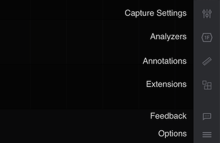

# Navigating the Software

The Logic 2 software consists of the following sections:

### 1. Logic Analyzer Connection Status

This button allows you to check your logic analyzer's connection status with the software. Clicking it will allow you to view device information such as the device type, serial number, and calibration status.



### 2. Configuring Input Channels & Setting the Sampling Rate

Use the Capture Settings panel to enable or disable channels, and to configure the sample rate for the configured channels.



### 3. Adding & Renaming Session Tabs

Click the "+" button to create new capture sessions tabs. This can be useful to manage multiple captures. To rename a tab, click the text within the tab.

.png>)

### 4. The Start Button

Click the green "Start" button to begin a data capture.&#x20;

* If a logic analyzer is not connected, this button will generate simulation data as if a logic analyzer was collecting real world data.&#x20;
* If a logic analyzer was connected, then this would begin capturing data from its enabled input channels. After the capture has started, you can stop it before it finishes, which will retain the data to that point.&#x20;

### 5. Side Panel Buttons

The side panel buttons offer various ways to configure your logic analyzer settings. More information on these settings can be found in the articles below.


[capture-settings.md](capture-settings.md)



[using-protocol-analyzers.md](using-protocol-analyzers.md)



[measurements-timing-markers.md](measurements-timing-markers.md)



[extensions](../../extensions/)


### 6. Time Scale Adjustment

The time scale for the displayed waveforms can be adjusted to an exact time value per 100 pixels as shown below. This gives the ability to set an exact zoom level, as opposed to using the mouse scroll wheel or using keyboard shortcuts to zoom in and out.



### Other Useful Features

Several more useful tasks can be performed from the main software view, such as...

* Renaming Channels
* Reordering, Resizing, & Scaling Channels
* Editing Colors

These features are described in our tutorial video below about organizing your workspace.


