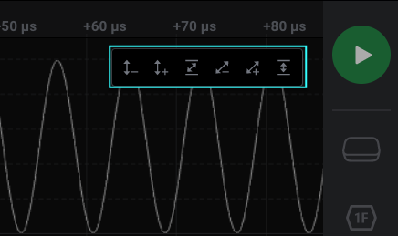

# Navigating Your Data

In the Logic 2 software, several methods exist for navigating your data. Here are some of the most common methods.

### Zooming, Panning, & Jumping to Edges

<table>
  <thead>
    <tr>
      <th style="text-align:left"></th>
      <th style="text-align:left"></th>
    </tr>
  </thead>
  <tbody>
    <tr>
      <td style="text-align:left">Zooming In and Out</td>
      <td style="text-align:left">
        
Mouse Wheel

        
Up/Down Arrow Keys

      </td>
    </tr>
    <tr>
      <td style="text-align:left">Panning Left and Right</td>
      <td style="text-align:left">
        
Mouse Click and Drag

        
Left/Right Arrow Keys

      </td>
    </tr>
    <tr>
      <td style="text-align:left">Jumping Between Edges</td>
      <td style="text-align:left">
        
Click the &quot;Next Edge&quot; button (shown below)

        <ul>
          <li>Hover your pointer on the right-most edge of the channel</li>
        </ul>
      </td>
    </tr>
  </tbody>
</table>

### Y-Axis Zoom for Analog Channels

The Y-axis zoom level for analog channels can be adjusted by hovering over the icon shown in the image below. It will appear at the top-right of an analog channel when hovering over that channel.

While hovering over the icon, several Y-axis zoom adjustment options become available as shown in the image below. These include:

* Y zoom-out / zoom-in / Y fit
* XY zoom-out / zoom-in / XY fit

### Navigating your Data via Keyboard Shortcuts

To view many more ways to navigate your data, you may open the Keyboard Shortcuts menu from within the Logic 2 software. More information on this can be found below.



## Logic 1.x

If you are using the older Logic 1.x software, the following images and instructions apply.

### **Zooming In and Out**

To zoom in and out, use your mouse wheel.

You can also use the up/down arrow keys or the plus/minus keys.

### **Panning Left and Right**

To pan left and right, click and drag the display.

You can also use the left/right arrow keys or the scroll bar at the bottom of the display.

### **Jumping between Digital Edges**

Sometimes digital data come in packets with long periods of idle in between.

To jump over idle periods, move your mouse to the far right or far left of a particular channel. A jump button will appear. Note that these buttons are not visible until you move your mouse cursor over the area where they are located. They will also only appear when you have captured data. They will not appear when the graph area is blank before a capture is taken.

Click this button to jump to the next digital transition on that channel.

You can also use the keyboard shortcuts N and P \("next" and "previous"\). The keyboard shortcut applies to the channel whose jump button was last pressed.

### **Scrolling through Channels**

Sometimes you may have more channels displayed than can fit on the screen at the same time.

Move your mouse over the channel labels on the left side of the software and scroll up and down with your mouse wheel.

Alternatively, there is a slider bar at the right side of the channel graphs.

You can also use the Page Up and Page Down keys.

