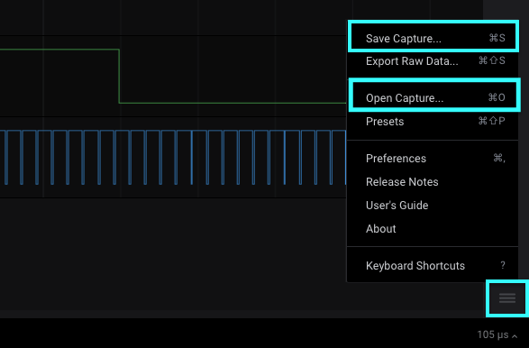

# Capture & Preset File Management

### Saving & Opening Captures

To save your current capture tab, click the Options button at the bottom right of the software, and click "Save Capture." To open an existing capture file (.sal file format), click the Options button and click "Open Capture."

### Saving & Opening Presets

The most recently used capture settings should be automatically loaded in the Logic 2 software upon opening the app. You can also save and load capture settings presets as needed. To open the Presets window, click the Options button at the bottom-right of the software, then click Presets.

This will open the Presets window below. From here, you can manage capture setting presets for the software. To share your presets with others, you can export your preset and import it into a new PC. Click on the 3 dots to the right of your preset to open up the options menu for that preset. This will allow you to load, rename, export, or delete you preset. To import a preset, click the _Import_ button at the bottom of the Presets window.

### Legacy Capture Files (.logicdata files)

To manage and open legacy capture files that were generated using the older Logic 1.x software (in .logicdata file format), you will need a copy of the older Logic 1.x software installed on your PC. Currently, we don't have a way of importing these capture files into the Logic 2 app. We're currently tracking user need for this feature in the [idea post here](https://ideas.saleae.com/b/feature-requests/import-logicdata-capture/).

For now, please refer to the support article below for more information on this topic.


[open-logicdata-files.md](../../faq/technical-faq/open-logicdata-files.md)


****
