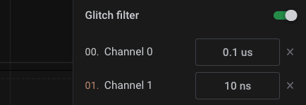

# Software Glitch Filter

The Logic software includes a feature to suppress short digital pulses in the recorded data. It is designed to help remove noise picked up in the digital recording. This can be especially useful when using protocol analyzers, since present noise may prevent proper decoding of digital data.

There are several sources of noise in digital captures. You can learn more about them below.


[seeing-spikes-in-digital-capture.md](../../troubleshooting/seeing-spikes-in-digital-capture.md)


### Enabling the Glitch Filter


Please note that the glitch filter must be configured before the capture is taken. The glitch filter is considered a pre-capture setting and cannot be modified after the capture is completed.


You can find the glitch filter settings via the 'Device Settings' panel button to the right of the software. You will need to click the slider and add the appropriate channels to enable it.

When editing the glitch filter value, you may select a unit of time, such as ns (nanosecond), us (microsecond), and ms (millisecond). You may also use non-integer values.

### What is a Glitch Filter?

The glitch filter is purely a software filter on top of the recorded data. Using the glitch filter does not actually change the data that is recorded. Instead, it sits between the recorded data set and all software components that access it.

Please note that the Logic Pro devices have narrow hysteresis thresholds, which can cause noise around transitions in some cases. When using lower voltage thresholds with larger swing signals, noise on the signal when it is in the low state can easily be picked up by the Saleae devices, even when the normal receiver of the signal rejects it. More information on our devices' voltage thresholds can be found in the support article below.


[supported-voltages.md](../supported-voltages.md)


The glitch filter can be set for any individual digital channel. We recommend only adding the filter to channels where noise is a problem. The glitch filter rejects all pulses narrower than a specific width. That width can be specified either by a specific maximum time.
