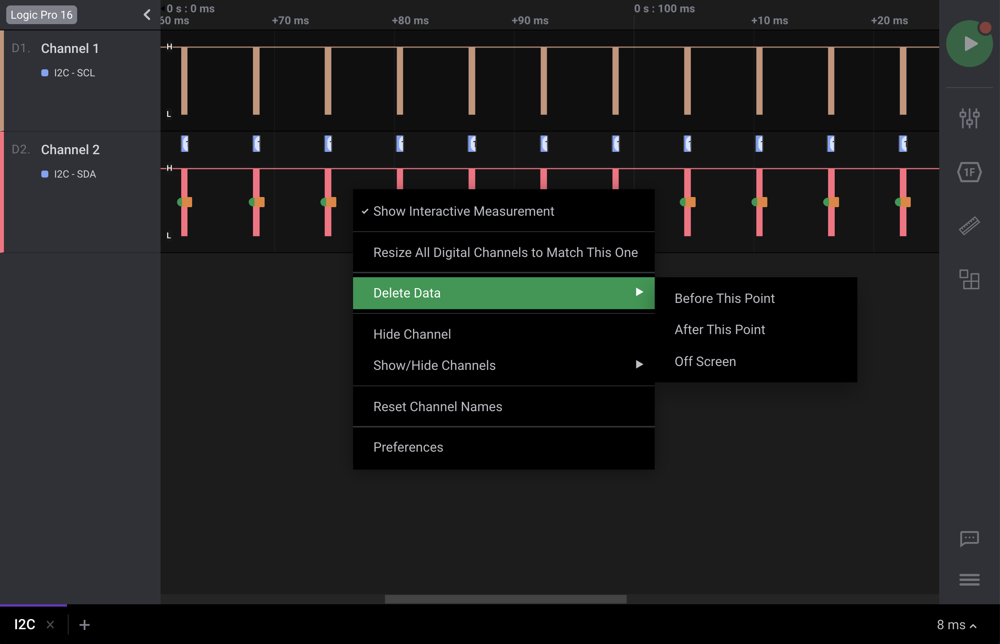

# Trimming Your Data

Your data can be trimmed or cropped as needed. This can be useful if only a portion of the data capture is needed. A few methods are described below.


Please keep in mind that trimming data is irreversible. Please backup any captured data by saving your original capture before trimming.


### Right-Click in the Waveform

Right-clicking any point in your capture will show the option to "Delete Data." You can delete the data before this point, after this point, or all the data off screen.

### Right-Click a Timing Marker

Right-clicking a timing marker will also show the option to "Delete Data." You can delete the data before the selected marker or after the marker. If your timing marker is part of a pair, you can also choose to delete data outside the pair.

